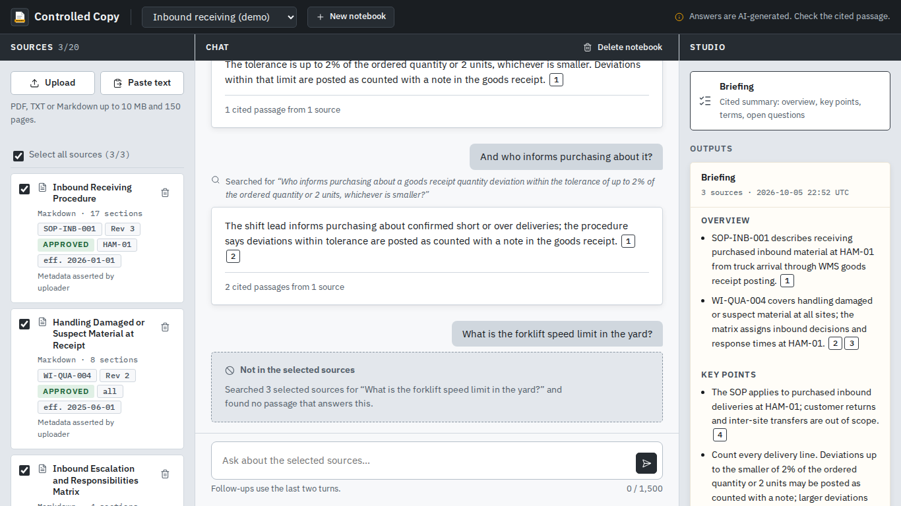

# Controlled Copy

**A NotebookLM-style notebook for controlled documents.**

You add your documents, ask questions, and get answers in which every statement links to the exact passage it came from. The server checks each quoted passage against the source before you see it. When your sources do not answer a question, the app says so instead of guessing.



This repository is a portfolio project built in four days. It runs on synthetic data only. Stage 1, the NotebookLM-style core, is complete and tested. Stage 2 adds a governed-documents layer (revisions, status, applicability and a Resolution Card) behind a feature flag. Stage 3 adds a model picker, Markdown export and a document-control form.

## What you can do

- **Sources:** upload PDF, TXT or Markdown, or paste text. Pick which sources a question may use. Open any source in a viewer that shows exactly the text the model saw, including text hidden in the original file.
- **Chat:** ask a question and get short statements with numbered citation chips. A chip opens the source at the highlighted passage. Follow-up questions use the last two turns, and the app shows the standalone search question it built.
- **Refusal:** a question your sources do not cover gets "Not in the selected sources", with what was searched.
- **Studio:** a Briefing (overview, key points, important terms, open questions) in which every item carries a verified citation. Suggested questions under an empty chat.
- **Deletion:** delete a source or a notebook and everything derived from it disappears: file, chunks, vectors, search index rows, and every answer or output generated from its passages.
- **Resolution Card** (governed layer): describe a situation at the dock and get what the applicable approved instructions require, what information is missing and who decides. Every requirement needs a verified quote from a document that is approved, effective on the chosen date and valid for the chosen site and role. Drafts, obsolete or superseded revisions and other sites' documents are named as "not applied", with the reason. The status (supported, context incomplete, expert confirmation required, conflicting instructions) is chosen by fixed rules: they decide which documents apply, which statements may count and the order of the statuses. Whether two cited passages really conflict, or information is missing, is still the model's reading, and it only counts with verified quotes. Each visitor gets their own copy of a curated "Inbound Operations" workspace and can reset it.
- **Models** (model picker layer): choose which evaluated model writes answers, Briefings and cards. Every answer shows the model that wrote it, and "(fallback)" when the fallback model stepped in.
- **Export:** copy any Briefing or Resolution Card as Markdown, or download it, with every verified quote listed under its citation number.
- **Document control:** type a document ID, revision, status, effective date, site and roles when you add a source, instead of writing YAML front matter. The app marks this metadata as asserted by the uploader.

## The ten questions

**1. What problem does it address?** At work, the right instruction often exists, but you have to find which document applies, whether it is the current revision, and whether the answer you were given really comes from it. Generic document chat answers fluently and mixes current and obsolete text without telling you.

**2. Who has the problem?** In the demo, a receiving operator and shift lead at a fictional distribution centre (Kestrova Components GmbH, site HAM-01) who need the current procedure for an exception at the dock. The process owner who maintains those documents owns the problem in real life. The core notebook works for anyone with documents.

**3. Why is ordinary document chat not enough?** It cites loosely or not at all, and it rarely refuses. Controlled Copy answers in statements that each need a quote from a passage that was actually retrieved; the server verifies the quote and drops any statement whose quote it cannot find. If nothing survives, you get a refusal.

**4. What did I prioritise?** A complete, recognisable NotebookLM core first: three panels (Sources, Chat, Studio), verified citations, follow-ups, refusal, a cited Briefing, and real deletion. Stage 2 adds document control: revision, status, effective date and site as metadata, a split into authoritative and excluded documents, and a Resolution Card that separates requirements from inferences and recommendations.

**5. What alternatives did I consider?** A pure clone (well covered by other projects), a draft checker, and a process-brief generator. For the stack, Streamlit and a Next.js front end lost to one FastAPI service with server-rendered HTML and htmx: one process, one language, full control over the layout. PostgreSQL with pgvector lost to SQLite for a single-node demo; the storage code sits behind one module, so pgvector stays the production path.

**6. What did I leave out on purpose?** Audio and video overviews, quizzes, mind maps, accounts and sharing, OCR, web import and DOCX. Each one adds parser or provider surface without serving the core promise.

**7. What data leaves the system?** Chunk text goes once to the embedding model at upload. For each question, the question and the top six passages go to the generation model. Both go through OpenRouter with zero-data-retention routing and data collection denied on every request. Vectors, files and chats stay in the app's SQLite file. Logs hold IDs, sizes, durations and token counts, never document text, questions or answers; a test checks this with a canary string.

**8. How does it handle unsupported information?** In three layers. Retrieval refuses before any answer is generated when the best match is weaker than an evidence floor (only the question itself is embedded for the comparison) (exact codes such as `GR-204` bypass it). The model must return statements with quotes in a fixed JSON schema. The server then checks every quote against its passage and removes what fails, so an answer the model invented cannot reach you with a citation attached.

**9. How did I evaluate it?** With mechanical checks only, no model judging another model. The generic set (G-01 to G-06) runs on a public 48-page PDF (NIST AI 100-1): three answerable questions, one unsupported question, one citation check and one Briefing in which every citation must verify. A model bake-off compared three embedding models on retrieval (hit@3, hit@5, mean reciprocal rank) and three generation models on six cases (schema validity, quote validity, outcome, latency, cost). The Resolution Card has its own set: 14 cases (E-01 to E-14) on the curated workspace, plus 11 held-out paraphrases (H-01 to H-11) that were written and committed before their first run, because the prompt had been tuned on the first set. GPT-6 Luna passes 13 of 14 and 11 of 11. The same sets compared five candidate fallback models; Gemini 3.5 Flash Lite won on the grounds that it runs on a different provider, answers in about two seconds and errs on the cautious side. They also chose the model picker's list: seven models passed without technical errors (GPT-6 Luna, GPT-6 Luna Pro, GPT-6 Sol, Gemini 3.7 Flash, Gemini 3.5 Flash Lite, Claude Sonnet 5.5 and GLM 5.2, whose misses were all on the cautious side). DeepSeek V4 Pro and V4.1 Flash, Kimi K2.6, Grok 4.7, Qwen 3.5 397B and GLM 5.1 were left out because too many calls failed or ran past the 45-second limit on zero-retention routes; any of them can still be added through `MODEL_CHOICES`. Results, misses included, are in [`eval/results/`](eval/results/). The sets are small, so the numbers are indicative only.

**10. What would production need?** Real sign-in instead of a shared access code, row-level isolation for a shared company workspace, a data processing agreement with every processor and EU-only model routing, document status coming from a real document-control system instead of uploaded front matter, a sandboxed parsing service with malware scanning, encryption at rest with deletion that reaches backups, monitoring, and a review with the works council and the data protection officer before any pilot.

## How it works

```
browser ── htmx ──> FastAPI (session cookie, CSRF token, strict CSP)
                     ├─ ingestion: type by content, PDF text in a time- and memory-limited subprocess,
                     │             chunks with exact offsets, front matter as metadata
                     ├─ SQLite: notebooks, sources, chunks, FTS5 index, vectors, chat, Studio outputs
                     ├─ retrieval: FTS5 (BM25) + exact cosine on stored vectors, reciprocal rank fusion,
                     │             evidence floor
                     ├─ answering: one structured model call, quote verification, numbered citations
                     └─ OpenRouter: baai/bge-m3 embeddings; openai/gpt-6-luna with
                                    google/gemini-3.5-flash-lite as fallback
```

More detail: [`docs/architecture.md`](docs/architecture.md). The governed layer (`FEATURE_GOVERNANCE`) and the model picker (`FEATURE_MODEL_PICKER`, allowlist `MODEL_CHOICES`) plug in through one registry; the core never imports them, and CI runs the whole core suite with every layer switched off and the full suite with every layer on.

## Run it

You need Python 3.12 or newer (developed on 3.14) and an OpenRouter API key.

```
python -m venv .venv
.venv/bin/pip install --require-hashes -r requirements-dev.lock
.venv/bin/pip install --no-deps -e .
cp .env.example .env        # then fill in OPENROUTER_API_KEY, APP_ACCESS_CODE, APP_SECRET_KEY
.venv/bin/uvicorn controlled_copy.app:app --port 8000
```

Open http://127.0.0.1:8000 and enter your access code.

With Docker Compose, Caddy terminates TLS in front of the app:

```
cp .env.example .env        # fill in the required values; Compose runs deploy mode by default
docker compose build --pull && docker compose up -d
```

Step-by-step server setup, updates and checks: [`docs/deployment.md`](docs/deployment.md). Security policy: [`SECURITY.md`](SECURITY.md).

The app refuses to start in deploy mode without a strong access code and secret key, with debug on, or with the fake model provider.

## Tests

```
.venv/bin/python -m pytest -m "stage1 and not eval and not smoke_live"                       # the core
FEATURE_GOVERNANCE=true FEATURE_MODEL_PICKER=true \
  .venv/bin/python -m pytest -m "(stage1 or stage2 or stage3) and not eval and not smoke_live"  # everything
```

Every test carries the ID of the test case it implements (for example `test_tc_src_011_...`), and every test case maps to a requirement in [`docs/testing.md`](docs/testing.md). The suite uses a deterministic fake model, so it needs no key and costs nothing. It includes unit, integration, API, security and browser tests (Playwright with Chromium), among them an automated WCAG contrast check. `scripts/test_report.py` turns a JUnit run into a requirement-to-result table.

The evaluation against the real model is manual: `python eval/run_eval.py generic`, `governed`, `holdout` and `python eval/bakeoff.py` (see [`eval/README.md`](eval/README.md)). A live check drives both journeys against a running instance with the real model: `LIVE_URL=https://... LIVE_ACCESS_CODE=... pytest -m smoke_live tests/live`.

## Privacy and security

- Synthetic demo data only. The landing page asks visitors not to upload personal or confidential documents.
- Each visitor gets an anonymous session; all data belongs to that session, and a foreign ID behaves like a missing one. Sessions not seen for seven days are deleted with everything in them.
- Processors: the host and OpenRouter with the model providers it routes to. EU in-region routing needs an OpenRouter business plan, so the demo does not claim it.
- I make no compliance claims. The design follows data-protection principles (minimal data, purpose limitation, deletion that works), and a production deployment would need the legal review listed under question 10.

## Limitations

A quote can exist in a passage and still not support the statement next to it; the app verifies existence, not support. Prompt injection inside a document can still bias wording within that notebook, although it cannot produce a citation the server cannot verify. There is no OCR, so scanned PDFs show a warning and contribute no text. English only.

## How AI tools were used

Claude Code wrote most of the code, tests and documents from my specification and decisions, and ran a structured self-audit at each milestone: code review, security review, insecure defaults, sharp edges, a differential review and a supply-chain check. Its findings and fixes are in the commit history. I make the product decisions, review the synthetic corpus for realism, and merge every pull request myself after an independent Codex review. The pull requests carry the full trail.

## Credits

- [htmx](https://htmx.org) 2.0.11 (0BSD), vendored.
- [IBM Plex Sans and Mono](https://github.com/IBM/plex) (SIL Open Font License 1.1), vendored from @fontsource.
- [Lucide](https://lucide.dev) icons (ISC).
- NIST AI 100-1 is used for the evaluation only; the runner downloads it from NIST and does not redistribute it.

Licensed under the MIT License (see [LICENSE](LICENSE)).
