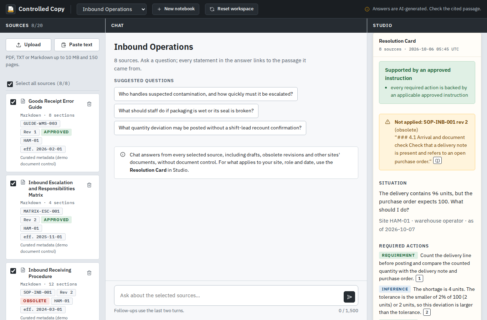
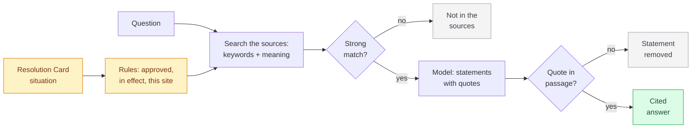

# Controlled Copy

**A NotebookLM-style notebook for controlled documents.**

Ask questions about your own documents. Every statement links to the exact passage it came from, and the server checks each quote against its source before you see it. When your sources do not cover a question, the app says so instead of guessing.

**Try it:** https://controlled-copy.remkostas.com (access code on request) · **Video:** coming soon


Built in four days with AI coding agents, on synthetic data: [how it was built](docs/how-it-was-built.md).

## Two-minute tour

1. Upload a PDF, TXT or Markdown file, click **Summarise the selected sources**, then ask a question and click a citation: the source opens at the passage.
2. Ask a follow-up, then something your sources do not cover: "Not in the selected sources". **New chat** starts over.
3. **Studio:** Summary, Briefing, FAQ or study guide, every point cited. A new output opens large over the chat; copy it, download it or print it. Collapse the Sources panel for more room.
4. **The addition:** open **Inbound Operations**, pick "Short delivery" and build a **Resolution Card**: what the current, approved instructions for this site require, what is missing, and who decides. Old revisions, drafts and other sites' documents are listed as not applied, with the reason.



## Scope

- **The clone:** notebooks of your own sources, cited chat with follow-ups and refusals, Studio reports, a source viewer, and deletion that also removes every answer built on a deleted source.
- **One addition:** document control. Revision, status, effective date, site and role are data, and fixed rules decide which documents may back an answer before the model writes anything. The core works without it (feature flag).
- **Left out on purpose:** audio and video overviews, mind maps, quizzes, web import, accounts. Answers appear once their quotes are verified, so they do not stream. Details: [design notes](docs/design-notes.md).

## How it works



Uploads are split into passages with exact offsets and indexed twice, as full text and as vectors, in one SQLite file. One FastAPI process serves htmx pages; models run through OpenRouter (BGE-M3 embeddings, GPT-6 Luna with Gemini 3.5 Flash Lite as fallback) with zero-data-retention routing requested, on a small server in Germany. More: [architecture](docs/architecture.md).

## Evidence

- **More than 500 automated tests** with a deterministic fake model, in CI with every optional layer off and on, including browser tests ([where to start](tests/README.md)). Most carry the ID of the test case they implement; the regression tests added during the reviews are named after what they guard.
- **Real model, on the released commit `535a152`:** 6 of 6 questions on a public 48-page PDF, 13 of 14 Resolution Cards (the miss chose the more cautious status), 11 of 11 reworded cases written before their first run. Scored by code, misses included ([evaluation](eval/README.md)).

## Limitations

- The app verifies that a quote exists in its passage, not that it fully supports the statement next to it.
- No OCR: scanned PDFs contribute no text. The interface is English; answers follow the language of the question.
- The test sets are small, so the numbers are indicative.

## Run it

Python 3.12 or newer and an OpenRouter API key:

```
python -m venv .venv && .venv/bin/pip install --require-hashes -r requirements-dev.lock
cp .env.example .env   # fill in OPENROUTER_API_KEY, APP_ACCESS_CODE, APP_SECRET_KEY
PYTHONPATH=src .venv/bin/uvicorn controlled_copy.app:app --port 8000
PYTHONPATH=src .venv/bin/python -m pytest -m "stage1 and not eval and not smoke_live"   # tests, no key needed
```

Docker Compose with Caddy: [deployment](docs/deployment.md). Browser tests need `playwright install chromium`.

## More

[How it was built](docs/how-it-was-built.md) · [decisions](docs/decisions.md) · [security](SECURITY.md) · milestones: PR #1 (core), #19 (document control), #20 (model picker, export), #21 to #50 (fixes after my own tests and the audits).

Synthetic demo data only; please do not upload personal documents. [Privacy notice](https://controlled-copy.remkostas.com/privacy). Sessions are deleted at log out or seven days after the last visit. Credits: [htmx](https://htmx.org) (0BSD), [IBM Plex](https://github.com/IBM/plex) (OFL 1.1), [Lucide](https://lucide.dev) (ISC); NIST AI 100-1 is downloaded for the evaluation, not redistributed. MIT License.
